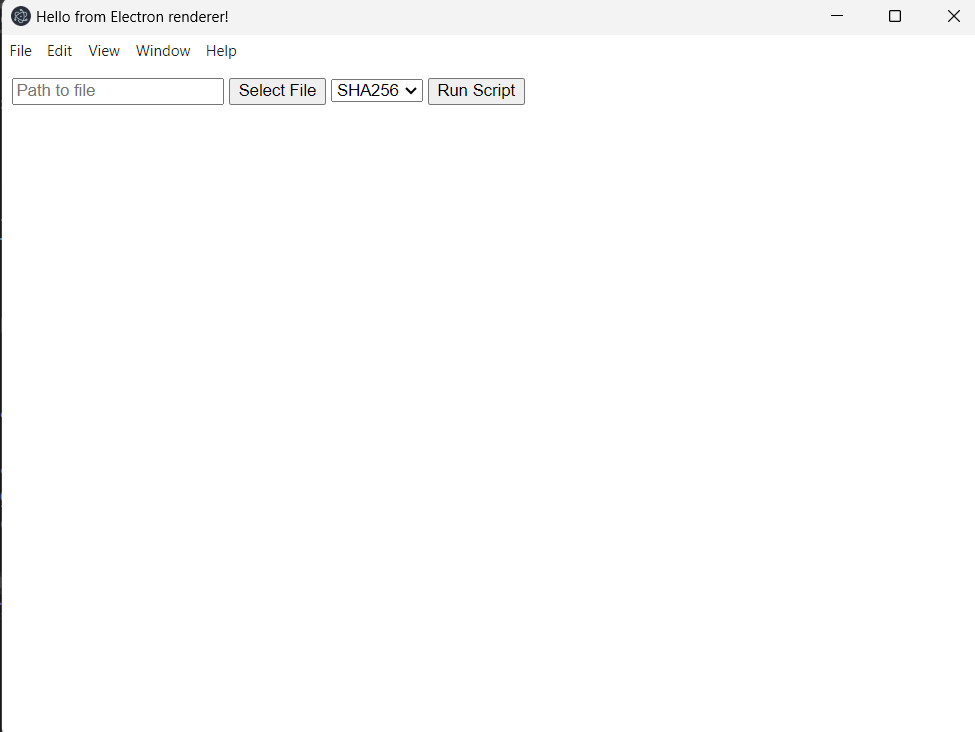
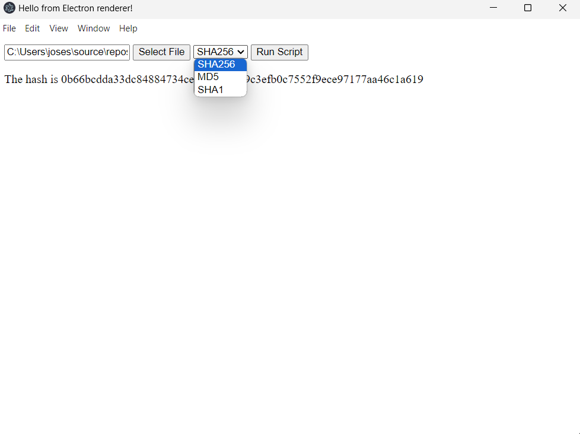
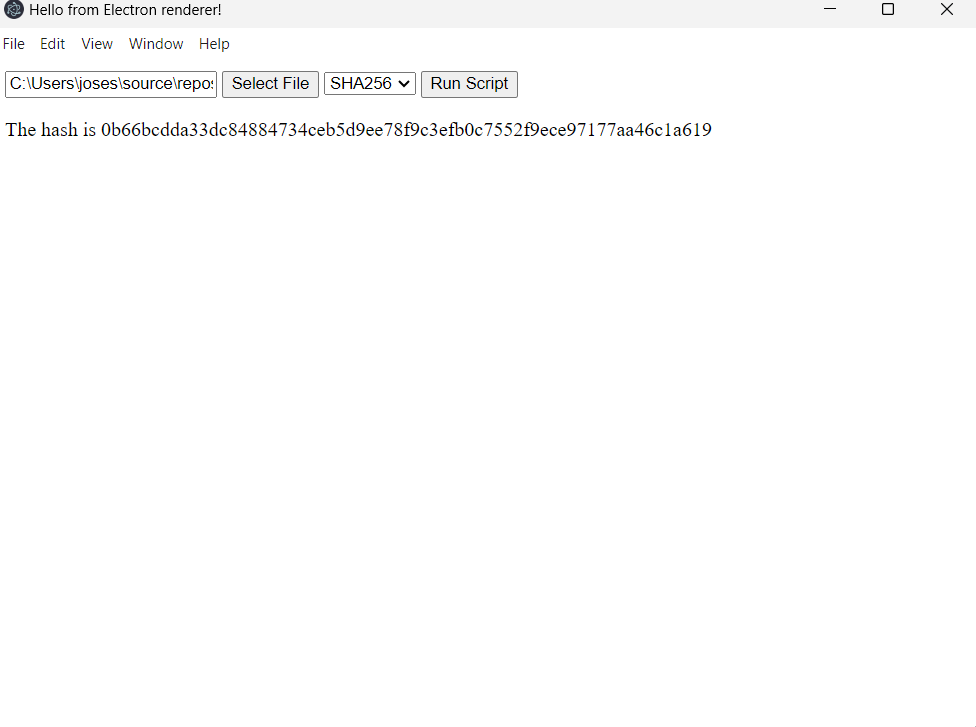

# CertUtil Electron App

This Electron Desktop Application using JavaScript to render a similar functioning application like that of the PowerShell, and Windows Form CertUtil Checker.

This is the appearance of the GUI.

These are the current hash selections:

Hash Computation:

## Acknowledgements

 - Professors at Kean University
 - Professors at NJIT
 - Research Mentors at Kean University
 - StackOverflow Q&A Discussion
 - ChatGPT
 - ClaudeAI

## Authors

- [@FPyC639](https://github.com/FPyC639)

## Appendix

